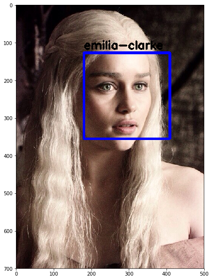

# Face Recognition and Identification in video using OpenCV and Python.

## Steps : Recognition
    1. Grayscale 
    2. Haar cascade classifier
    3. Region of Interest
    
## Steps : Identification
    4. Training data
    5. Training the LBPH Face Recognizer 
    6. Using the recognizer
    
## Result :

